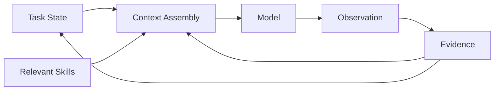

<div align="center">

  <p align="center">
    <picture>
      <source media="(prefers-color-scheme: dark)" srcset="assets/logo-dark.svg">
      
    </picture>
  </p>

</div>

# Wait a Minute (WAM)

### Deterministic control and state management for OpenCode agents

WAM keeps more state than it sends.

WAM adds deterministic control, task-state management, context reconstruction, skill routing, and evidence-backed verification to OpenCode agents. It correlates task state, skills, context, evidence, and verification to determine what should happen next.

#### Context-Query-Core Integration (CQE)

WAM ships a CQE adapter (`src/context/cqe-adapter.js`) that integrates [context-query-core](https://github.com/khnker/context-query-core), a fast, in-process code-evidence retriever using SQLite + trigram indexing for lexical and symbolic snippet matching.

Modes: `disabled`, `shadow`, `enabled`. The adapter defaults to `enabled` when invoked directly; override with `WAM_CQE_MODE`, or disable with `WAM_CQE=0`. It is currently exercised through the retrieval A/B benchmark (`benchmarks/retrieval/`) and the CQE test suites — it is **not yet wired into WAM's runtime context-retrieval path**.

Benchmark (fixture corpus, k=5, 10 queries): CQE retrieved **142 tokens vs. 302 for the baseline** ripgrep search — **52.98% fewer tokens** — with higher precision (0.617 vs 0.613) and MRR (0.700 vs 0.683), and comparable recall (0.70 vs 0.75). Reproduce with:

```bash
node benchmarks/retrieval/run-ab.mjs --corpus fixture --k 5
```

The adapter is designed to be safe: it never alters task state, distinguishes empty results from errors, and falls back to native retrieval on any issue.

[Install](#install) [Documentation](#documentation)

PROVEN IN RC1

| Evidence                       |                  Result | Meaning                                                                     |
| ------------------------------ | ----------------------: | --------------------------------------------------------------------------- |
| OpenCode Hook                  | Prompt-level integration | Intercepts requests before skill resolution and agent execution. [docs/architecture/overview.md](docs/architecture/overview.md) |
| Persistent State               | Per-task / per-session isolation | Task state is persisted and scoped instead of relying on conversation history alone. [docs/claims/task-isolation.md](docs/claims/task-isolation.md) |
| Fail-Closed Verification       | Unverified completion is blocked | Tasks cannot transition to completion while supported outstanding work remains. [docs/claims/verification.md](docs/claims/verification.md) |
| Deterministic Validation       | 10/10 cases passed      | RC1 snapshot harness: 10 cases passed, 0 failed. [docs/RC1_VALIDATION.md](docs/RC1_VALIDATION.md) |
| Context Reduction              | 69.6%                   | Measured on the deterministic RC1 snapshot harness. [docs/benchmarks/results.md](docs/benchmarks/results.md) |
| Net Input Savings              | 32.6%                   | Observed in one credentialed real-provider run. [docs/benchmarks/results.md](docs/benchmarks/results.md) |

> WAM separates implementation guarantees from empirical measurements. Claims in this README are backed by implementation, tests, deterministic benchmarks, or explicitly labeled observations.
> 
> The 32.6% result is an observed single-provider run, not a general token-reduction claim. WAM reports deterministic, dry-run, and real-provider measurements separately because they are not directly comparable.

## What WAM changes

| Agent workflow | Traditional | With WAM |
|---|---|---|
| Task continuity | Conversation history | Explicit task state |
| Context | Accumulates | Reconstructed |
| Skills | Available broadly | Routed to task |
| Assumptions | Implicit | Classified |
| Evidence | Often transient | Persisted with task |
| Completion | Model assertion | Verification state |
| Next action | Conversation-driven | State + evidence |

## The core idea

### WAM keeps more state than it sends

An agent does not need all available state in every model call.

WAM maintains task state separately from transient model context and reconstructs
the smallest useful context for the current decision.



The model sees what it needs for the current decision.
WAM retains the state needed to continue the task.

## How WAM works

On each request, WAM:
1. **Classifies** the request (task type, domain, etc.)
2. **Inspects** the current task state (requirements, assumptions, evidence)
3. **Establishes** the necessary state for this iteration (updates known/unknown)
4. **Selects** relevant skills and context for the task
5. **Executes** the agent with the prepared context and skills
6. **Observes** the output and any effects
7. **Verifies** evidence against completion criteria
8. **Determines** the next action based on verified state

Control decisions (what to do next) are based explicitly on task state and verified evidence, not on what remains accidentally in conversation history.

## Why WAM

Modern AI agents treat conversation history as their primary state mechanism, creating real problems:

- **Context pollution**: Irrelevant details from prior conversations (e.g., UI discussions, unrelated topics) accumulate in the context window and can inappropriately influence technical decisions.
- **Non-deterministic behavior**: Identical requests can yield different results depending on accidental conversation history, making agents unpredictable for engineering workflows.
- **Context window exhaustion**: Conversation history consumes tokens regardless of relevance, reducing space for the current task and forcing truncation or information loss.
- **Audit difficulty**: When agents cannot trace decisions to explicit state and evidence, validation and reproducible behavior become impossible.

WAM treats this as a state management problem, not a conversation problem. By making task state the source of truth:
- Context focuses on task-relevant information.
- Control flow becomes explicit and traceable.
- Context window is used efficiently for immediate needs only.
- Every decision links to verifiable state and evidence.

## Getting started

### Install

```bash
npm install opencode-wait-a-minute
```

The npm package is `opencode-wait-a-minute`; the repository is `opencode-wait-a-minute`.

### Enable in OpenCode

```jsonc
// opencode.jsonc
{
  "plugins": ["opencode-wait-a-minute"]
}
```

Once installed, WAM intercepts requests before skill resolution and agent execution. Its control and state-management flow applies automatically.

**Requirements:** Node `>=20` · OpenCode `>=1.18.0` — tested on Ubuntu 24.04, Node 24.16.0, OpenCode 1.18.33 ([docs/RC1_VALIDATION.md](docs/RC1_VALIDATION.md)).

## Where WAM fits

WAM operates at the boundary between prompting and agent execution, enhancing the control plane without replacing existing layers:

```
OpenCode
  ├── Agents
  ├── Skills
  ├── Tools
  └── Plugins
         ↑
        WAM
        │
        ├─ Task state
        ├─ Context reconstruction
        ├─ Skill routing
        ├─ Assumption/uncertainty handling
        ├─ Evidence
        └─ Verification/recovery
```

- **OpenSpec** manages task/change specification and structured change workflows.
- **Superpowers / Skills** provide development methodology and reusable procedures.
- **WAM** provides the control plane + task state + context/evidence orchestration.

## Capabilities

- **Persistent task state**: Maintains requirements, assumptions, evidence, and decisions across model turns.
- **Context reconstruction**: Assembles minimal useful context from verified files, skills, and evidence.
- **Skill routing**: Selects and provides only skills relevant to the current task.
- **Assumption and uncertainty management**: Classifies information as known, inferred, assumed, or unknown to guide exploration.
- **Evidence orchestration**: Treats observed evidence as first-class citizen that updates state and gates completion.
- **State-based verification**: Completion depends on verified state, not model judgment.
- **Isolation and recovery**: Each task's state remains associated with it and does not contaminate other tasks.

## Validation

WAM is verified through:
- **Unit and integration tests**: Core logic, state assembly, skill selection, and verification gates.
- **End-to-end tests with OpenCode**: Complete workflows from request to observation.
- **Benchmark measurements**: Token usage, context reconstruction efficiency, and control flow determinism.
- **Isolation validation**: Ensures one task's state does not affect another.

See [docs/claims/](docs/claims/) for detailed claims and evidence documentation.

## Documentation

| Topic | Documentation |
|---|---|
| Architecture | [docs/architecture/](docs/architecture/) |
| Concepts | [docs/concepts/](docs/concepts/) |
| Claims and validation | [docs/claims/](docs/claims/) |
| OpenCode compatibility | [docs/OPENCODE_COMPATIBILITY.md](docs/OPENCODE_COMPATIBILITY.md) |
| RC1 validation | [docs/RC1_VALIDATION.md](docs/RC1_VALIDATION.md) |
| RC1 release scope | [docs/RC1_SCOPE.md](docs/RC1_SCOPE.md) |

## Sources and influences

WAM builds on and integrates with existing work in the agent ecosystem:

- **OpenCode** — host/runtime and plugin/skill environment
- **OpenSpec** — structured task/change workflow
- **Superpowers** — composable software-development methodology
- **WAM's own implementation and benchmark evidence**

## Development and testing

```bash
# Run test suite
npm test

# Run validation gate (if configured)
npm run gate
```

## License

| License | Copyright |
|---|---|
| MIT | 2026 Khnker |

[MIT License](LICENSE)
