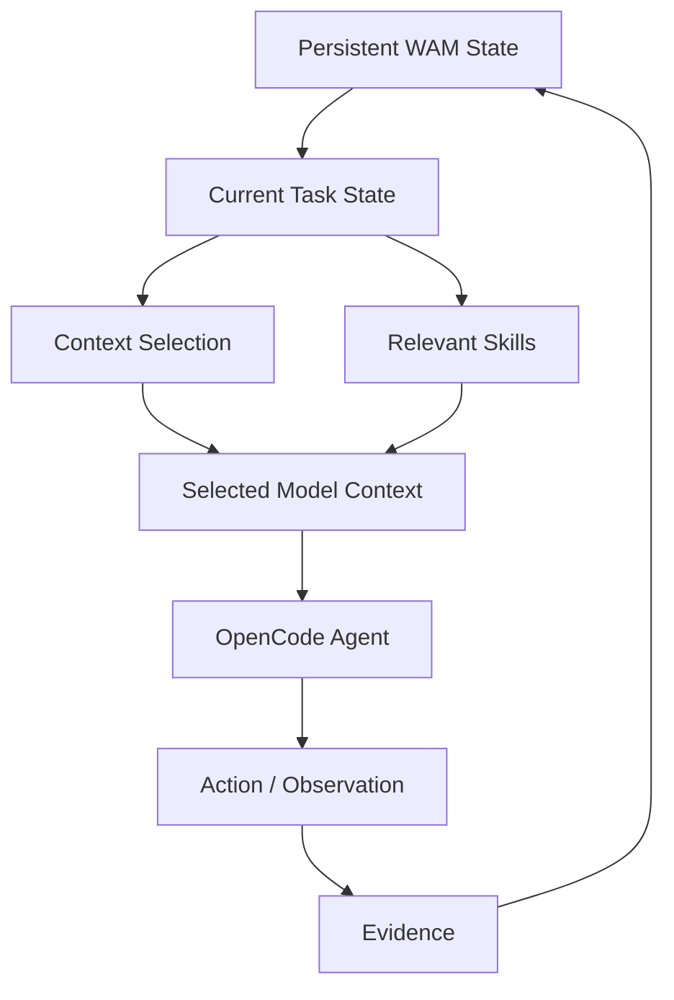
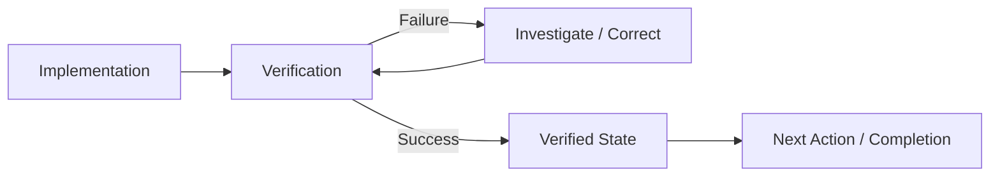
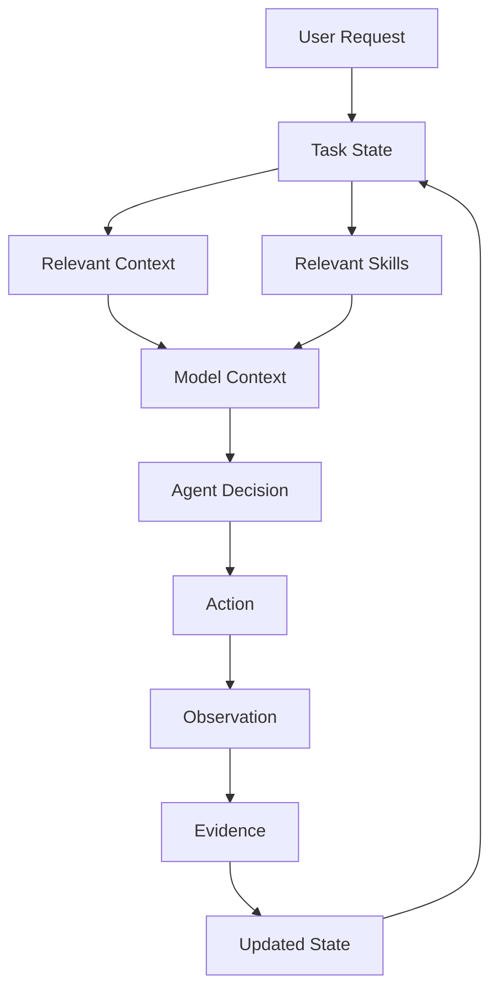

# Wait a Minute

> **WAM keeps more state than it sends.**

WAM adds deterministic control, task-state management, context enrichment, and
token optimization to OpenCode agents by correlating tasks, skills, context,
evidence, and verified state to determine what should happen next.

## The core idea

WAM separates **persistent task state** from **transient model context**.

The task keeps its state.

The model receives only the context required for the current decision.



This distinction is central to WAM:

> **Context is derived from task state, not accumulated from conversation
> history.**

## Why this matters

An agent can accumulate a large amount of conversational and repository context
while only a small part of that information is relevant to its next decision.

WAM maintains the broader task state and reconstructs the context needed for the
current state. That allows the system to preserve knowledge without continuously
sending all of that knowledge back to the model.

## Tasks are isolated

Tasks have their own identity and state.

```text
Task A
Fix payment timeout
```

Its relevant state may include:

```text
Stripe API
payment-service.ts
retry configuration
timeout logs
verification evidence
```

After Task A finishes:

```text
Task B
Update README
```

Task A's state remains associated with Task A. It does not automatically become
Task B's model context.

Task B can instead reconstruct context around:

```text
README.md
repository documentation
documentation structure
relevant skills
current documentation state
```

This is the basis of task isolation and context separation. See
[Task Isolation](docs/claims/task-isolation.md) and
[Context Separation](docs/concepts/context-separation.md).

## Context enrichment

Context is not only selected from files. WAM enriches the task with relevant
skills and other task-specific information before the agent makes its next
decision.

```text
Task
Add a PostgreSQL migration
```

Relevant capabilities may include:

```text
PostgreSQL
database migration
testing
```

while unrelated capabilities such as Angular UI or CSS should not become part of
the task context merely because they exist in the repository.

The exact selection mechanism is documented in
[Context Selection](docs/architecture/context-selection.md).

## Evidence changes what happens next

WAM treats evidence as part of task state.



The important property is not simply that verification exists. Verification
produces state that can influence the next control decision.

## Core capabilities

| Capability            | Purpose                                                                    |
| --------------------- | -------------------------------------------------------------------------- |
| Deterministic control | Make control decisions from explicit state and inputs                      |
| Task-state management | Preserve verified progress across turns                                    |
| Context separation    | Keep persistent state separate from transient model context                |
| Context enrichment    | Add task-relevant context and skills                                       |
| Task isolation        | Prevent unrelated task state from becoming active context                  |
| Verification          | Tie progression and completion to evidence                                 |
| Context optimization  | Reconstruct task-relevant context instead of replaying accumulated history |
| Token optimization    | Measure the input-token consequences of context selection                  |

## Context reduction

The RC1 validation target is:

> **WAM reduces task-relevant model context by at least 60% while preserving
> verified task state.**

The measurement is based on the task-relevant model context selected for the
current decision.

The benchmark separates:

- context reduction;
- WAM overhead;
- net input savings;
- model output tokens;
- provider-specific billing behavior.

The current evidence is reported as-is in
[Benchmark Results](docs/benchmarks/results.md): the deterministic validation
harness reports a 69.6% total reduction, while the shipped dry-run configuration
reports **negative** net input savings. Both are kept separate and neither is
quoted as a real-model token saving. See
[Benchmark Methodology](docs/benchmarks/methodology.md) for the accounting rules.

## How WAM works



The implementation details are documented in
[Architecture Overview](docs/architecture/overview.md).

## Claims and evidence

Each major WAM claim has a dedicated document connecting the claim to its
implementation and tests.

- [Deterministic Control](docs/claims/deterministic-control.md)
- [Task State](docs/claims/task-state.md)
- [Context Management](docs/claims/context-management.md)
- [Skill Selection](docs/claims/skill-selection.md)
- [Task Isolation](docs/claims/task-isolation.md)
- [Verification](docs/claims/verification.md)
- [Less Guessing](docs/claims/less-guessing.md)

See the [Claims Index](docs/claims/README.md).

## Validation

The WAM premise is validated through controlled behavioral tests rather than
through documentation alone.

The validation strategy tests:

- deterministic decisions;
- task-state reconstruction;
- task isolation;
- context selection;
- skill enrichment;
- evidence-driven transitions;
- completion control;
- context reduction.

See [Premise Validation](docs/validation/premise.md) and the
[Causal Decision Matrix](docs/validation/causal-decision-matrix.md).

## Benchmarks

The benchmark suite keeps different evidence classes separate:

1. deterministic internal validation;
2. empirical provider execution;
3. external mechanism evidence.

See:

- [Benchmarks Overview](docs/benchmarks/README.md)
- [Benchmark Methodology](docs/benchmarks/methodology.md)
- [Benchmark Results](docs/benchmarks/results.md)
- [Benchmark Limitations](docs/benchmarks/limitations.md)
- [RC1 Evidence](docs/benchmarks/RC1.md)

## Installation

```bash
npm install wait-a-minute
```

## Development

See:

- [Contributing](docs/development/contributing.md)
- [Testing](docs/development/testing.md)

## Compatibility

See [Compatibility](docs/architecture/compatibility.md) for the currently
supported OpenCode and Node.js versions.

## Documentation map

### Concepts

- [State vs Context](docs/concepts/state-vs-context.md)
- [Task / Context Lifecycle](docs/concepts/task-context-lifecycle.md)
- [Context Separation](docs/concepts/context-separation.md)
- [Context Enrichment](docs/concepts/context-enrichment.md)
- [Evidence-Driven State](docs/concepts/evidence-driven-state.md)

### Architecture

- [Overview](docs/architecture/overview.md)
- [Task Lifecycle](docs/architecture/task-lifecycle.md)
- [Context Selection](docs/architecture/context-selection.md)
- [State Persistence](docs/architecture/state-persistence.md)
- [Invariants](docs/architecture/invariants.md)

### Validation

- [Premise Validation](docs/validation/premise.md)
- [Causal Decision Matrix](docs/validation/causal-decision-matrix.md)

---

**WAM keeps more state than it sends.**
