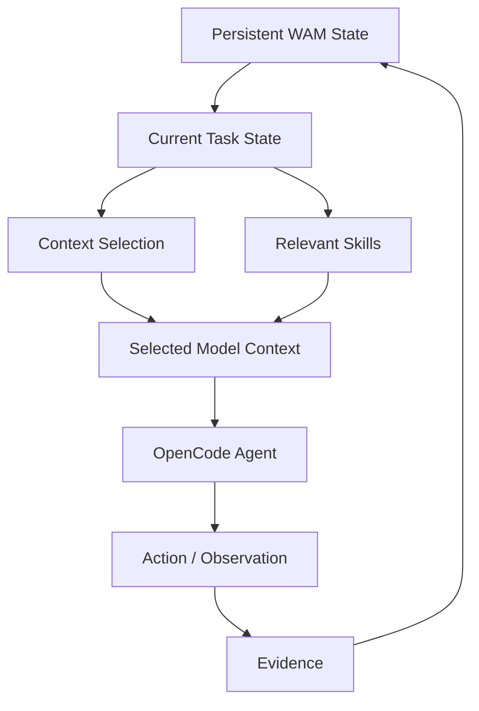
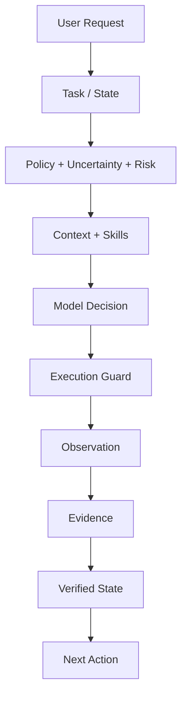
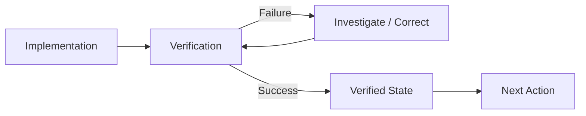

<p align="center">
  <picture>
    <source media="(prefers-color-scheme: dark)" srcset="assets/logo-dark.svg">
    
  </picture>
</p>

<div align="center">

[](https://nodejs.org/)
[](https://nodejs.org/)
[](./LICENSE)

</div>

# Wait a Minute

> ### WAM keeps more state than it sends.

WAM adds deterministic control, task-state management, context enrichment, and
token optimization to OpenCode agents by correlating tasks, skills, context,
evidence, and verified state to determine what should happen next.

---

## Quick start

Install the plugin and enable it in OpenCode. No further configuration is required.

```bash
npm install wait-a-minute
```

```jsonc
// opencode.jsonc
{
  "plugins": ["wait-a-minute"]
}
```

WAM intercepts prompts before skill resolution and agent execution. Once
installed, its control and state-management flow applies automatically.

**Requirements:** Node `>=20` · OpenCode `>=1.18.0` — tested on Ubuntu 24.04,
Node 24.16.0, OpenCode 1.18.33 ([docs/RC1_VALIDATION.md](docs/RC1_VALIDATION.md)).

---

## The core idea

WAM separates **persistent task state** from **transient model context**.

| | Persistent | Transient |
|---|---|---|
| **Where it lives** | WAM state store | Model context window |
| **Lives across** | Model turns; recoverable across sessions/resumes | Single decision |
| **What it holds** | Task state, requirements, evidence, decisions and recovery information | Only what's relevant *now* |

> **Context is derived from task state, not accumulated from conversation
> history.**



---

## Why this matters

An agent can accumulate a large amount of conversational and repository context
while only a small part of that information is relevant to its next decision.

WAM maintains the broader task state and reconstructs the context needed for the
current state. That allows the system to preserve knowledge without continuously
sending all of that knowledge back to the model.

WAM can reduce task-relevant model input by reconstructing only the context
required for the current decision. Quantitative results and methodology live in
[docs/benchmarks](docs/benchmarks).

---

## What WAM actually changes

| Without WAM | With WAM |
|-------------|----------|
| Conversation is the main continuity mechanism | Task state is persisted explicitly |
| Context tends to accumulate | Context is reconstructed |
| Skills may be broadly available | Skills are routed to the task |
| Completion can rely on model judgment | Completion is tied to verification state |
| Next action comes from conversation | Next action is derived from task state + evidence |
| Context boundaries are implicit | Tasks have explicit state boundaries |

---

## How WAM works

On each prompt, WAM classifies the request, persists task state, reconstructs
context, and gates completion on verification. Policy, uncertainty, and risk
gate the decision; execution guards gate actions; completion follows from
verified state rather than model judgment.



---

## Tasks are isolated

Tasks have their own identity and state.

```text
Task A
Fix payment timeout
```

Its relevant state may include:

- Stripe API
- payment-service.ts
- retry configuration
- timeout logs
- verification evidence

After Task A finishes:

```text
Task B
Update README
```

Task A's state remains associated with Task A. It does not automatically become
Task B's model context.

Task B can instead reconstruct context around:

- README.md
- repository documentation
- documentation structure
- relevant skills
- current documentation state

This is the basis of task isolation and context separation. See
[Task Isolation](docs/claims/task-isolation.md) and
[Context Separation](docs/concepts/context-separation.md).

---

## Context enrichment

Context is not only selected from files. WAM enriches the task with relevant
skills and other task-specific information before the agent makes its next
decision.

```text
Task
Add a PostgreSQL migration
```

Relevant capabilities may include:

- PostgreSQL
- database migration
- testing

while unrelated capabilities such as Angular UI or CSS should not become part of
the task context merely because they exist in the repository.

The exact selection mechanism is documented in
[Context Selection](docs/architecture/context-selection.md).

---

## Task skills can be combined

A single task often needs more than one skill. WAM composes multiple skills into
a single decision using dependency constraints, layer boundaries, and conflict
rules rather than letting skills compete against each other.

- **`dependsOn`** — skills that must be selected first. Ordering is derived from
  the dependency graph, so e.g. a `backend-integrity` prerequisite is applied
  before the implementing skill.
- **`conflicts`** — mutually exclusive skills (e.g. `angular-developer` vs
  `nestjs-best-practices`, frontend vs backend). Incompatible selections are
  pruned instead of both being injected.
- **Layer gating** — each skill is restricted to `frontend`, `backend`,
  `shared`, or `infrastructure`, so a backend-only skill cannot mutate a frontend
  file.
- **Execution patterns** — dependency-composed skill graphs are executed as
  composed workflows with `required`, `optional`, `conditional`, `parallel`,
  `retry`, and `fallback` step modifiers.

All of this is covered by the multi-skill injection tests
(`tests/unit/skill-injection-registry.test.mjs`,
`tests/unit/skill-injection.test.mjs`,
`tests/unit/multilayer-skill-injection.test.mjs`).

---

## Evidence changes what happens next

WAM treats evidence as part of task state.



Without evidence, the agent cannot distinguish "done" from "assumed done".
With evidence, the next action follows from verified state, not from guessing.

---

## Validation

WAM's claims are independently documented and validated through:

- deterministic behavioral fixtures;
- state reconstruction tests;
- task-isolation tests;
- context-selection tests;
- skill-routing tests;
- verification/completion tests;
- paired baseline/WAM benchmark runs.

See [docs/validation/premise.md](docs/validation/premise.md),
[docs/RC1_VALIDATION.md](docs/RC1_VALIDATION.md), and
[docs/claims](docs/claims).

---

## Benchmarks & evidence

WAM reports **three evidence classes separately** — they are never merged into a
single number. Reproduce the committed bundle with `npm run report:rc1` (writes
`benchmarks/reports/rc1/`).

### A. Internal deterministic (no network)

Source: `benchmarks/run-validation.mjs`

| Metric | Result |
|--------|--------|
| Snapshot correctness | 10 / 10 passed |
| Fast-path count | 34 |
| Context rebuilds | 8 (5 full · 3 partial) |
| Deterministic accounting | 8 scenarios · 42 turns · **69.6% total reduction** |

### B. Empirical real (dry-run · mock provider · no network)

Source: `benchmarks/run-real.mjs` (`runDryRun`)

| Metric | Result |
|--------|--------|
| Input tokens — baseline | 195 |
| Input tokens — WAM | 420 |
| Rebuilds | 30 |
| State equivalent | true |
| Net input savings | **-225** |

> The two sections measure different things on different harnesses: the internal
> deterministic suite shows a **69.6%** reduction, while the dry-run mock
> provider shows WAM overhead exceeding baseline (**net savings -225**). They do
> not contradict each other, and **no single net-savings number is claimed**.
> `outcomeMatch` (0 / 30) compares stochastic text and is not a correctness
> signal.

### C. External evidence

Source: `benchmarks/evidence/sources.json` — 6 sources (2 provider · 2 academic ·
2 open-source). Provider-side cache savings are reported separately from WAM's
internal metrics.

Full methodology: [docs/benchmarks/RC1.md](docs/benchmarks/RC1.md) · bundle: [benchmarks/reports/rc1](benchmarks/reports/rc1).

---

## Documentation

| Area | Read |
|------|------|
| Architecture | [docs/architecture](docs/architecture) |
| Concepts | [docs/concepts](docs/concepts) |
| Claims | [docs/claims](docs/claims) |
| Validation | [docs/validation](docs/validation) |
| Benchmarks | [docs/benchmarks](docs/benchmarks) |
| Development | [docs/development](docs/development) |

---

## Development & testing

```bash
npm test                  # full suite (scripts/run-tests.mjs)
npm run test:validation   # validation tests (benchmarks/validation)
npm run test:isolation    # task-isolation tests
npm run test:e2e:opencode # OpenCode end-to-end smoke
npm run benchmark         # dry-run benchmark
npm run benchmark:real    # real provider run
npm run report:rc1         # RC1 evidence report
npm run gate              # release gate
```

See [docs/development/testing.md](docs/development/testing.md) and
[docs/development/contributing.md](docs/development/contributing.md).

---

## Configuration

WAM is on by default. Each capability can be toggled independently via
environment variables (highest precedence) or a project `.wam/config.json`:

| Flag | Env var | Effect |
|------|---------|--------|
| `skills` | `WAM_SKILLS=false` · `WAM_DISABLE_SKILLS=1` | Skip skill discovery, routing and injection |
| `logging` | `WAM_SILENT=1` · `WAM_DISABLE_LOGGING=1` | Silence WAM file + console diagnostics |
| `enforcement` | `WAM_GOVERNANCE=off` · `WAM_BYPASS=1` | Disable contract governance blocking |

```jsonc
// .wam/config.json
{
  "skills": false,
  "logging": false,
  "enforcement": false
}
```

Precedence: `WAM_*` env → `.wam/config.json` → defaults (all `true`).
Inspect the effective config with `/wam config` (`/wam config path` for the file).

---

## Known interactions

WAM injects the selected skill bodies through the `chat.message` hook and reads tool
output (files, searches) to assemble context. Other host-side plugins that rewrite or
prune those outputs can interfere:

- **Output deduplication.** Plugins such as Dynamic Context Pruning (DCP) can replace
  repeated tool results with a `[dedup:ref sha=…]` placeholder when
  `strategies.deduplication.enabled` is `true` and `protectedTools` is empty. Reads or
  searches WAM depends on then come back as a reference instead of content. Protect the
  context-gathering tools, e.g. `"protectedTools": ["read", "grep", "glob"]`, or disable
  deduplication.
- **Skill injection budget.** Skill bodies are injected at level N3 within the remaining
  flex budget. Task-matched skills are injected before always-on base skills; when the
  budget runs out the rest are skipped and the reason is recorded in the pack rationale
  (`N3: budget agotado para skills`). Skills without embedded content are reported as
  `sin contenido embebido` and cannot be injected.

---

## License

| License | Copyright |
|---------|-----------|
| [MIT](./LICENSE) | © 2026 khnker |

## Sources & Ecosystem

WAM builds upon standard patterns from community-driven ecosystems and specifications:
- **Agent Skills & Primitives:** Inspired by the [Awesome GitHub Copilot](https://github.com/github/awesome-copilot) collection and the [Agent Skills specification](https://agentskills.io/specification) for self-contained, modular capabilities.
- **Spec-Driven Development (OpenSpec):** Integrates strict spec-driven design, traceability, and architectural change management via OpenSpec workflows.
