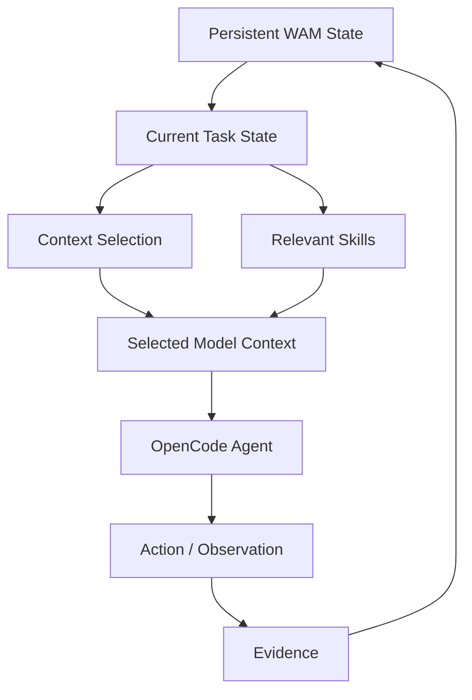
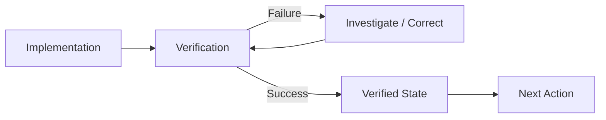

<p align="center">
  <picture>
    <source media="(prefers-color-scheme: dark)" srcset="assets/logo-dark.svg">
    
  </picture>
</p>

<div align="center">

[](https://www.npmjs.com/package/wait-a-minute)
[](https://nodejs.org/)
[](./LICENSE)

</div>

# Wait a Minute

> ### WAM keeps more state than it sends.

WAM adds deterministic control, task-state management, context enrichment, and
token optimization to OpenCode agents by correlating tasks, skills, context,
evidence, and verified state to determine what should happen next.

---

## The core idea

WAM separates **persistent task state** from **transient model context**.

| | Persistent | Transient |
|---|---|---|
| **Where it lives** | WAM state store | Model context window |
| **Lives across** | Tasks, sessions, resumes | Single decision |
| **What it holds** | Everything the task needs | Only what's relevant *now* |

> **Context is derived from task state, not accumulated from conversation
> history.**



---

## Why this matters

An agent can accumulate a large amount of conversational and repository context
while only a small part of that information is relevant to its next decision.

WAM maintains the broader task state and reconstructs the context needed for the
current state. That allows the system to preserve knowledge without continuously
sending all of that knowledge back to the model.

---

## Tasks are isolated

Tasks have their own identity and state.

```text
Task A
Fix payment timeout
```

Its relevant state may include:

- Stripe API
- payment-service.ts
- retry configuration
- timeout logs
- verification evidence

After Task A finishes:

```text
Task B
Update README
```

Task A's state remains associated with Task A. It does not automatically become
Task B's model context.

Task B can instead reconstruct context around:

- README.md
- repository documentation
- documentation structure
- relevant skills
- current documentation state

This is the basis of task isolation and context separation. See
[Task Isolation](docs/claims/task-isolation.md) and
[Context Separation](docs/concepts/context-separation.md).

---

## Context enrichment

Context is not only selected from files. WAM enriches the task with relevant
skills and other task-specific information before the agent makes its next
decision.

```text
Task
Add a PostgreSQL migration
```

Relevant capabilities may include:

- PostgreSQL
- database migration
- testing

while unrelated capabilities such as Angular UI or CSS should not become part of
the task context merely because they exist in the repository.

The exact selection mechanism is documented in
[Context Selection](docs/architecture/context-selection.md).

---

## Evidence changes what happens next

WAM treats evidence as part of task state.



Without evidence, the agent cannot distinguish "done" from "assumed done".
With evidence, the next action follows from verified state, not from guessing.

---

## Quick start

```bash
# Install
npm install wait-a-minute

# Configure OpenCode
# Add to your opencode.jsonc:
# {
#   "plugins": ["wait-a-minute"]
# }
```

WAM intercepts prompts before skill resolution and agent execution. No
configuration required for basic use — it just works.

---

## Documentation

| Area | Read |
|------|------|
| Architecture | [docs/architecture](docs/architecture) |
| Concepts | [docs/concepts](docs/concepts) |
| Claims | [docs/claims](docs/claims) |
| Benchmarks | [benchmarks](benchmarks) |

---

## License

MIT