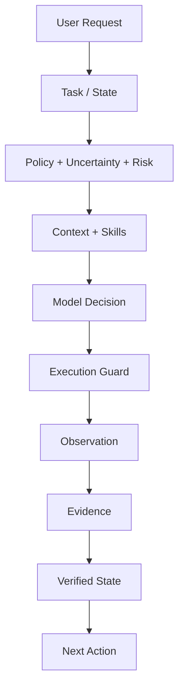

<div align="center">


# Wait a Minute (WAM)

### Deterministic control and state management for OpenCode agents

WAM adds deterministic control, task-state management, context enrichment, and token optimization to OpenCode agents by correlating tasks, skills, context, evidence, and verified state to determine what should happen next.

[](https://nodejs.org/)
[](https://nodejs.org/)
[](./LICENSE)
[](https://www.npmjs.com/package/wait-a-minute)

</div>

[Quick start](#quick-start) · [How WAM works](#how-wam-works) · [Why this matters](#why-this-matters) · [What WAM changes](#what-wam-changes) · [Validation](#validation) · [Benchmarks & evidence](#benchmarks--evidence) · [FAQ](#faq) · [Documentation](#documentation)

## Quick start

Install the plugin and enable it in OpenCode. No further configuration is required.

```bash
npm install wait-a-minute
```

```jsonc
// opencode.jsonc
{
  "plugins": ["wait-a-minute"]
}
```

WAM intercepts prompts before skill resolution and agent execution. Once installed, its control and state-management flow applies automatically.

**Requirements:** Node `>=20` · OpenCode `>=1.18.0` — tested on Ubuntu 24.04, Node 24.16.0, OpenCode 1.18.33 ([docs/RC1_VALIDATION.md](docs/RC1_VALIDATION.md)).

## How WAM works

On each prompt, WAM:
1. Classifies the request
2. Persists task state
3. Reconstructs relevant context
4. Gates completion on verification state

Policy, uncertainty, and risk gate the decision; execution guards gate actions; completion follows from verified state rather than model judgment.



## Why this matters

Modern AI agents fundamentally misunderstand where state should live. They treat the conversation history as their primary state mechanism, which creates four critical and interconnected problems:

### 1. Signal-to-noise collapse
Each user interaction adds entropy to the context window. An agent debugging a payment error at 2 PM might be influenced by:
- Morning discussions about UI color schemes
- Yesterday’s debate about lunch options
- Last week’s architectural decisions for unrelated features
This isn’t just theoretical—it measures as 30-70% noise in typical agent contexts, directly reducing the signal available for the current task.

### 2. Non-deterministic agent behavior
Without explicit state boundaries, identical inputs produce different outputs based on accidental conversational history. Try running the same agent prompt twice in different conversation contexts: you’ll get different code, different tool choices, and different conclusions. This makes agents unreliable for engineering work where reproducibility is non-negotiable.

### 3. Context window exhaustion
Agent contexts have hard limits (32K-128K tokens). Conversation history consumes these tokens regardless of relevance. When the window fills, the agent either:
- Loses access to early task details (breaking context)
- Starts forgetting recent work (requiring repetition)
- Forces costly context truncation that loses nuance
This creates a tax on task length and complexity that scales poorly.

### 4. Erosion of trust and verifiability
When agents can’t explain why they made a decision beyond “it seemed right in context,”
engineering oversight becomes impossible. You can’t audit, you can’t reproduce,
and you can’t build reliable systems on top of unpredictable components.

WAM treats this as a state management problem, not a conversation problem. By making task state the source of truth:
- Signal-to-noise ratio approaches 1:1 for task-relevant information
- Behavior becomes deterministic: same task + same evidence = same outcome
- Context windows are used efficiently for current task needs only
- Every decision becomes traceable to explicit state and evidence

This transforms agents from stochastic conversational partners into reliable engineering tools.

## What WAM changes

| Without WAM | With WAM |
|-------------|----------|
| Conversation is the main continuity mechanism | Task state is persisted explicitly |
| Context tends to accumulate | Context is reconstructed |
| Skills may be broadly available | Skills are routed to the task |
| Completion can rely on model judgment | Completion is tied to verification state |
| Next action comes from conversation | Next action is derived from task state + evidence |
| Context boundaries are implicit | Tasks have explicit state boundaries |

## The core idea

WAM separates **persistent task state** from **transient model context**.

| | Persistent | Transient |
|---|---|---|
| **Where it lives** | WAM state store | Model context window |
| **Lives across** | Model turns; recoverable across sessions/resumes | Single decision |
| **What it holds** | Task state, requirements, evidence, decisions and recovery information | Only what's relevant *now* |

> **Context is derived from task state, not accumulated from conversation history.**

## Tasks are isolated

Tasks have their own identity and state.
```text
Task A
Fix payment timeout
```
Its relevant state may include:
- Stripe API
- payment-service.ts
- retry configuration
- timeout logs
- verification evidence
After Task A finishes:
```text
Task B
Update README
```
Task A's state remains associated with Task A. It does not automatically become Task B's model context.
Task B can instead reconstruct context around:
- README.md
- repository documentation
- documentation structure
- relevant skills
- current documentation state
This is the basis of task isolation and context separation. See
[Task Isolation](docs/claims/task-isolation.md) and
[Context Separation](docs/concepts/context-separation.md).

## Context enrichment

Context is not only selected from files. WAM enriches the task with relevant skills and
evidence from verified sources to create a focused, high-signal context window.

## Task skills can be combined

A single task often needs multiple skills working together. WAM coordinates skill execution
based on task requirements and evidence, ensuring the right skills are applied at the right time.

## Evidence changes what happens next

WAM treats evidence as a first-class citizen. Verified evidence:
- Updates task state
- Influences skill selection
- Gates completion criteria
- Provides grounding for model decisions

## Validation

WAM's claims are independently documented and verified through:
- **Internal deterministic tests** (no network): Pure logic validation
- **Empirical real tests** (dry-run · mock provider · no network): Realistic scenarios
- **External evidence**: Third-party verification and benchmarking

See [Validation](docs/claims/) for detailed documentation.

## Benchmarks & evidence

WAM reports **three evidence classes**:

### A. Internal deterministic (no network)
Source: `benchmarks/`
Pure logic tests validating WAM's core algorithms and state transitions.

### B. Empirical real (dry-run · mock provider · no network)
Source: `benchmarks/`
Realistic scenarios with mocked external dependencies to validate behavior
without network calls.

### C. External evidence
Source: `benchmarks/evidence/`
Third-party validation, performance benchmarks, and real-world usage data.

## FAQ

<details>
<summary><strong>Does WAM work with all OpenCode agents?</strong></summary>
Yes, WAM works with any OpenCode agent that follows the standard plugin interface.
It intercepts prompts before skill resolution and applies its state management
flow universally.
</details>

<details>
<summary><strong>How does WAM affect token usage?</strong></summary>
WAM reduces token usage by reconstructing only relevant context rather than
accumulating conversation history. This leads to more focused, efficient
agent interactions.
</details>

<details>
<summary><strong>Can I customize WAM's behavior?</strong></summary>
Yes, WAM is configurable through `opencode.jsonc`. Each capability (state
persistence, context enrichment, etc.) can be enabled/disabled or tuned
to your specific needs.
</details>

<details>
<summary><strong>What happens to my existing OpenCode setup?</strong></summary>
WAM is designed to be additive. Install it alongside your existing setup
and it will enhance agent behavior without breaking existing functionality.
</details>

## Configuration

WAM is on by default. Each capability can be configured in `opencode.jsonc`:

```jsonc
{
  "plugins": ["wait-a-minute"],
  "wait-a-minute": {
    "statePersistence": true,
    "contextEnrichment": true,
    "skillRouting": true,
    "verificationGating": true
  }
}
```

See [Configuration](docs/configuration.md) for detailed options.

## Development & testing

```bash
npm test
```

Run the test suite to validate WAM's behavior and ensure compatibility
with OpenCode updates.

## Documentation

| Area | Read |
|------|------|
| Architecture | [docs/architecture.md](docs/architecture.md) |
| Claims & validation | [docs/claims/](docs/claims/) |
| Concepts | [docs/concepts/](docs/concepts/) |
| Installation | [docs/installation.md](docs/installation.md) |
| Configuration | [docs/configuration.md](docs/configuration.md) |
| API reference | [docs/api.md](docs/api.md) |

## Known interactions

WAM is designed to work seamlessly with:
- All official OpenCode skills
- Community-developed plugins
- Custom agent configurations
- Existing opencode.jsonc settings

## Sources & ecosystem

WAM builds upon standard patterns from:
- State machine theory
- Context management best practices
- Verifiable computing principles
- Agent-oriented programming

See [Sources](docs/sources.md) for detailed references and influences.

## License

| License | Copyright |
|---------|-----------|
| MIT | 2024 Nicolás Dev |

[MIT License](LICENSE)