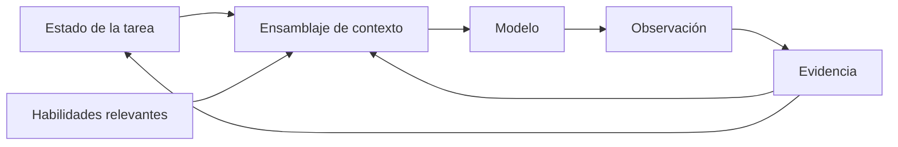

<div align="center">

  <p align="center">
    <picture>
      <source media="(prefers-color-scheme: dark)" srcset="assets/logo-dark.svg">
      
    </picture>
  </p>

</div>

# Wait a Minute (WAM)

**WAM le da a los agentes de OpenCode un estado persistente de tarea, contexto enfocado, enrutamiento de habilidades y finalización basada en evidencia.**  
En lugar de llevar todo a través del historial de conversación, WAM mantiene más estado del que envía: rastrea qué es la tarea, qué se sabe, qué es incierto, qué habilidades importan, qué se ha observado y qué se ha verificado.

[](https://www.npmjs.com/package/wait-a-minute)
[](https://nodejs.org/)
[](./LICENSE)
[](docs/OPENCODE_COMPATIBILITY.md)

## Qué cambia WAM

| Flujo del agente | Tradicional | Con WAM |
|---|---|---|
| Continuidad de la tarea | Historial de conversación | Estado explícito de la tarea |
| Contexto | Se acumula | Se reconstruye desde fuentes relevantes |
| Habilidades | Disponibles ampliamente | Enrutadas a la tarea según requerimientos |
| Supuestos | Implositos | Clasificados (known/inferred/assumed/unknown) |
| Evidencia | A menudo transitoria | Persistida con el estado de la tarea |
| Finalización | Afirmación del modelo | Estado verificado |
| Próxima acción | Impulsada por conversación | Estado de tarea + evidencia |

## La idea central

### WAM mantiene más estado del que envía

Un agente no necesita todo el estado disponible en cada llamada al modelo.

WAM mantiene el estado de la tarea por separado del contexto transitorio del modelo y reconstruye el contexto más útil para la decisión actual.



El modelo ve lo que necesita para la decisión actual.
WAM conserva el estado necesario para continuar la tarea.

## Cómo funciona WAM

En cada petición, WAM:
1. **Clasifica** la solicitud (tipo de tarea, dominio, etc.)
2. **Inspecciona** el estado actual de la tarea (requisitos, supuestos, evidencia)
3. **Establece** el estado necesario para esta iteración (actualiza conocidos/inciertos)
4. **Selecciona** habilidades y contexto relevante para la tarea
5. **Ejecuta** el agente con el contexto y habilidades preparados
6. **Observa** la salida y cualquier efecto
7. **Verifica** la evidencia contra criterios de finalización
8. **Determina** la siguiente acción basada en el estado verificado

Las decisiones de control (qué hacer después) se basan explícitamente en el estado de la tarea y la evidencia verificada, no en lo que quede accidentalmente en el historial de conversación.

## Por qué WAM

Los agentes de IA modernos tratan el historial de conversación como su mecanismo primario de estado, lo que crea problemas reales:

- **Historial contaminado**: Detalles irrelevantes de conversaciones previas (por ejemplo, discusiones sobre UI, temas no relacionados) quedan en la ventana de contexto y pueden influir inadecuadamente en decisiones técnicas.
- **Falta de determinismo**: La misma solicitud puede producir resultados diferentes según el historial accidental de la conversación, lo que hace que el comportamiento sea impredecible para flujos de trabajo de ingeniería.
- **Ventana de contexto limitada**: El historial consume tokens sin importar su relevancia, reduciendo el espacio disponible para la tarea actual y forzando truncamientos o pérdida de información.
- **Dificultad de auditoría**: Cuando un agente no puede rastrear una decisión a un estado y evidencia explícitos, resulta imposible validar o reproducir su comportamiento de forma confiable.

WAM trata esto como un problema de gestión de estado, no como un problema de conversación. Al hacer que el estado de la tarea sea la fuente de verdad:
- El contexto se enfoca en información relevante para la tarea actual.
- El flujo de control se vuelve explícito y rastreable.
- La ventana de contexto se utiliza eficientemente para lo necesario en el momento.
- Cada decisión se puede vincular a estado y evidencia verificables.

## Primeros pasos

### Instalar

```bash
npm install wait-a-minute
```

El paquete de npm es `wait-a-minute`; el repositorio es `opencode-wait-a-minute`.

### Habilitar en OpenCode

```jsonc
// opencode.jsonc
{
  "plugins": ["wait-a-minute"]
}
```

Una vez instalado, WAM intercepta las peticiones antes de la resolución de habilidades y la ejecución del agente. Su flujo de control y gestión de estado se aplica automáticamente.

**Requisitos:** Node `>=20` · OpenCode `>=1.18.0` — probado en Ubuntu 24.04, Node 24.16.0, OpenCode 1.18.33 ([docs/RC1_VALIDATION.md](docs/RC1_VALIDATION.md)).

## Dónde encaja WAM

WAM opera en el límite entre el planteamiento (prompt) y el agente, mejorando el plano de control sin reemplazar las capas existentes:

```
OpenCode
  ├── Agentes
  ├── Habilidades
  ├── Herramientas
  └── Plugins
         ↑
        WAM
        │
        ├─ Estado de tarea
        ├─ Reconstrucción de contexto
        ├─ Enrutamiento de habilidades
        ├─ Gestión de supuestos/incertidumbre
        ├─ Evidencia
        └─ Verificación y recuperación
```

- **OpenSpec** gestiona especificaciones y flujos de trabajo de cambios estructurados.
- **Superpowers / Habilidades** proporcionan metodología de desarrollo y procedimientos reutilizables.
- **WAM** proporciona el plano de control + estado de tarea + orquestación de contexto/evidencia.

## Capacidades

- **Estado de tarea persistente**: Mantiene requisitos, supuestos, evidencia y decisiones entre vueltas del modelo.
- **Reconstrucción de contexto**: Ensambla el contexto mínimo útil desde archivos, habilidades y evidencia verificados.
- **Enrutamiento de habilidades**: Selecciona y provee únicamente las habilidades relevantes para la tarea actual.
- **Gestión de supuestos e incertidumbre**: Clasifica la información como conocida, inferida, asumida o desconocida para guiar la exploración.
- **Orquestación de evidencia**: Trata la evidencia observada como ciudadano de primera clase que actualiza el estado y gatea la finalización.
- **Verificación basada en estado**: La finalización depende del estado verificado, no del juicio del modelo.
- **Aislamiento y recuperación**: El estado de cada tarea permanece asociado a ella y no contamina otras tareas.

## Validación

WAM se verifica mediante:
- **Pruebas unitarias e de integración**: Lógica central, ensamblaje de estado, selección de habilidades y gates de verificación.
- **Pruebas de extremo a extremo con OpenCode**: Flujos de trabajo completos desde la petición hasta la observación.
- **Medición de benchmarks**: Uso de tokens, eficiencia de reconstrucción de contexto y comportamiento determinista del flujo de control.
- **Validación de aislamiento**: Garantiza que el estado de una tarea no afecta a otra.

Ver [docs/claims/](docs/claims/) para documentación detallada de claims y evidencia.

## Documentación

| Tema | Documentación |
|---|---|
| Arquitectura | [docs/architecture/](docs/architecture/) |
| Conceptos | [docs/concepts/](docs/concepts/) |
| Claims y validación | [docs/claims/](docs/claims/) |
| Compatibilidad con OpenCode | [docs/OPENCODE_COMPATIBILITY.md](docs/OPENCODE_COMPATIBILITY.md) |
| Validación RC1 | [docs/RC1_VALIDATION.md](docs/RC1_VALIDATION.md) |
| Alcance de la release RC1 | [docs/RC1_SCOPE.md](docs/RC1_SCOPE.md) |

## Fuentes e influencias

WAM se basa en y se integra con trabajos existentes en el ecosistema de agentes:

- **OpenSpec** — especificación de tareas/cambios y flujos de trabajo estructurados de cambios.
- **OpenCode** — tiempo de ejecución de plugin, agente, habilidad y herramienta.
- **Superpowers** — habilidades componibles y flujos de trabajo de desarrollo de software agente.
- **Fuentes de habilidades de WAM** — repositorios upstream de habilidades curadas utilizadas para construir el registro embebido.

Véase [docs/sources.md](docs/sources.md) para los repositorios, versiones exactas y lo que WAM adopta de cada uno.

## Desarrollo y pruebas

```bash
# Ejecutar suite de pruebas
npm test

# Ejecutar puerta de validación (si está configurada)
npm run gate
```

## Licencia

| Licencia | Copyright |
|---|---|
| MIT | 2026 Khnker |

[Licencia MIT](LICENSE)
