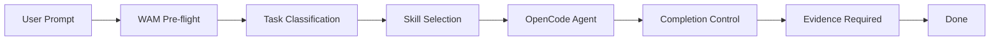

# Architecture Overview

## Components

## Layer separation

WAM operates as a prompt hook. It does not modify OpenCode internals.

## Related documentation

- [Task Lifecycle](task-lifecycle.md)
- [Context Selection](context-selection.md)
