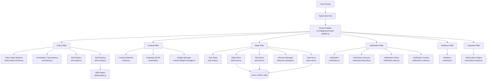

# Architecture Overview

WAM is an OpenCode prompt hook. It observes prompts, reconstructs task context,
gates completion, and persists task state. It does not modify OpenCode internals.

## Component map

## Layer separation

- **Runtime adapters own host interaction** (`src/integration/router-adapter.js`
  and runtime adapters).
- **Pillars must not import orchestration**; `shared` must not import domain
  pillars (see `wam-architecture-taxonomy` and
  [Invariants](invariants.md)).
- **No network in runtime skill loading**: the skill catalogue is embedded at
  build time.
- **Runtime state** (`.wam/`) is never tracked in git nor published; see
  [State Persistence](state-persistence.md).

## Related documentation

- [Task Lifecycle](task-lifecycle.md)
- [Context Selection](context-selection.md)
- [State Persistence](state-persistence.md)
- [Invariants](invariants.md)
