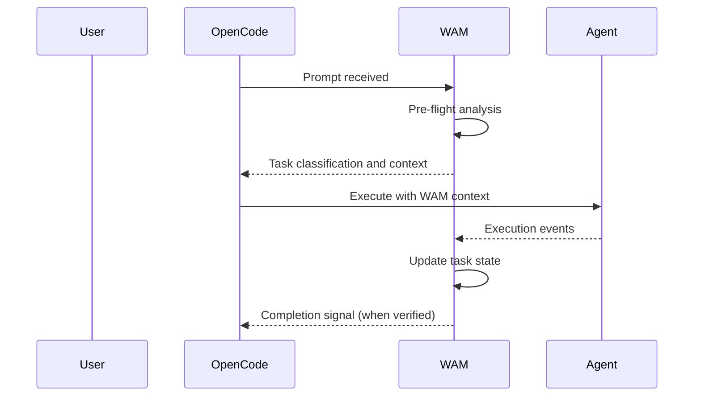

# Runtime

## How WAM interacts with OpenCode

WAM operates as a prompt hook in the OpenCode lifecycle:

## Responsibilities

WAM is responsible for:
- Prompt analysis and task classification
- Context selection and loading
- Skill selection and loading
- Task state management
- Evidence collection and verification
- Completion control

OpenCode remains responsible for:
- Agent execution
- Skill implementation
- File system operations
- Command execution

## Related documentation

- [Architecture Overview](overview.md)
- [Persistence](persistence.md)
