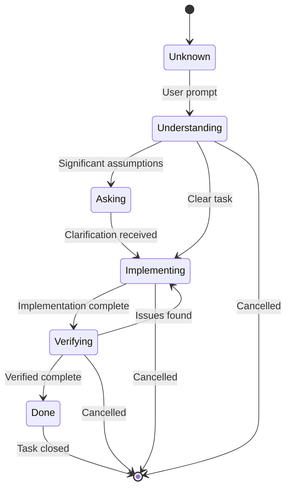

# Task Lifecycle

## States

## Transitions

Each transition requires specific evidence:
- Unknown → Understanding: Repository inspection
- Understanding → Asking: Assumption analysis
- Asking → Implementing: User clarification
- Implementing → Verifying: Implementation signal
- Verifying → Done: Verification pass
- Verifying → Implementing: Verification failure

## Related documentation

- [Architecture Overview](overview.md)
- [Context Selection](context-selection.md)
