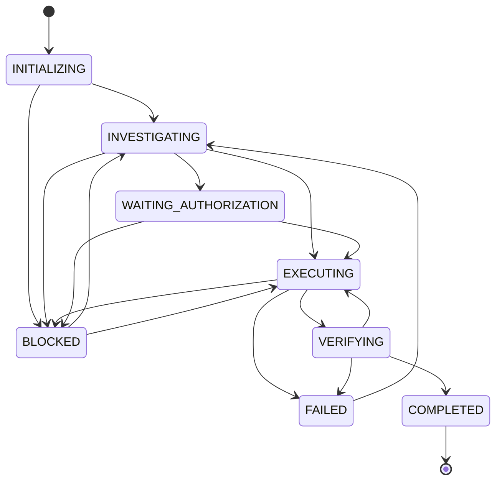

# Task Lifecycle

The authoritative lifecycle is the formal execution state machine in
`src/execution/execution-state.js`. This document mirrors that implementation.

## States

## Legal transitions

Anything not listed throws:

| From | To |
| --- | --- |
| `INITIALIZING` | `INVESTIGATING`, `BLOCKED` |
| `INVESTIGATING` | `EXECUTING`, `WAITING_AUTHORIZATION`, `BLOCKED` |
| `EXECUTING` | `VERIFYING`, `BLOCKED`, `FAILED` |
| `VERIFYING` | `COMPLETED`, `EXECUTING`, `FAILED` |
| `WAITING_AUTHORIZATION` | `EXECUTING`, `BLOCKED` |
| `BLOCKED` | `INVESTIGATING`, `EXECUTING` |
| `FAILED` | `INVESTIGATING` |
| `COMPLETED` | _(terminal — none)_ |

## Invariants

- `COMPLETED` is terminal.
- `transition()` to `COMPLETED` throws while `hasOutstandingWork(taskState)` is
  true (unverified requirements or pending backlog). Fail-closed.
- Invalid state strings throw (`validateState`).
- Legacy phases map via `migrateLegacyPhase`; unknown phases default to
  `INITIALIZING`.

## Related documentation

- [Architecture Overview](overview.md)
- [Context Selection](context-selection.md)
- [Evidence](../concepts/evidence-driven-state.md)
