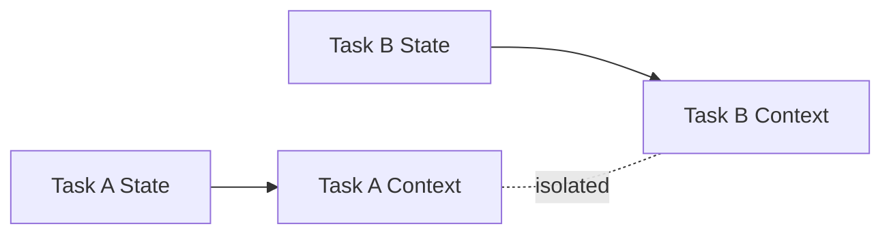

# Context Separation

WAM separates context by task identity and relevance.

## Task boundary

A task represents a unit of work with its own state. Context associated with one
task should not automatically become context for another task.



## Example

```text
Task A
Fix payment timeout
```

may contain payment-related state.

```text
Task B
Update README
```

should reconstruct documentation-related context.

The existence of payment state does not make payment state relevant to the README
task.

## Why separation matters

Task isolation reduces:

- accidental assumptions;
- unrelated context;
- evidence contamination;
- incorrect continuation;
- unnecessary model input.

## Implementation verification

The task-boundary mechanism is implemented in:

- session identity — `getSessionId(root, sessionID)` in `src/context/context.js`
  scopes the session to a specific `(root, OpenCode sessionID)` pair, so
  different roots never share session state;
- active-context selection — `retrieveActiveContext(items, purpose)` in
  `src/context/active-context-boundary.js` filters which context items are
  active for the current purpose;
- task storage — task state is namespaced by task id under
  `.wam/tasks/<taskId>/` (`src/state/task-store.js`).

The isolation guarantee is exercised by
`tests/isolation/run.mjs` (a completed task does not leak into a new task) and
`tests/runtime-state-isolation.test.mjs` (runtime state stays out of git and out
of the published package). See [Task Isolation](../claims/task-isolation.md).

## See also

- [State vs Context](state-vs-context.md)
- [Task Isolation](../claims/task-isolation.md)
