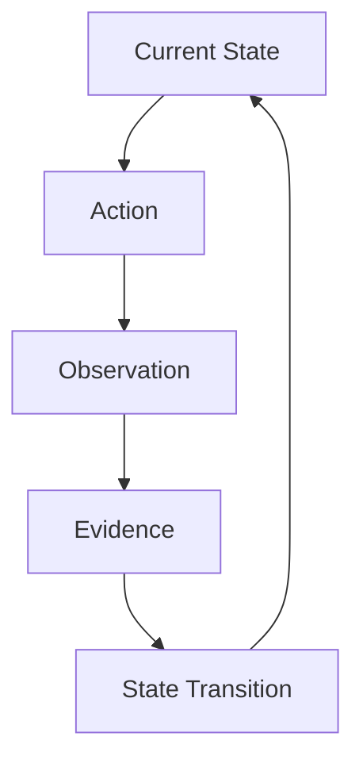

# Evidence-Driven State

WAM treats evidence as a first-class input to task progression.

## Principle

A state transition should be grounded in evidence appropriate to that
transition.

## Verification

Evidence can determine whether a task:

- remains in implementation;
- returns to investigation;
- enters verification;
- becomes verified;
- reaches completion.

## Completion

Completion is tied to the evidence required by the active verification policy.
The formal state machine (`src/execution/execution-state.js`) refuses the
transition to `COMPLETED` while `hasOutstandingWork(taskState)` is true — that
is, while there are unverified requirements or pending backlog. The check is
fail-closed: completion is blocked, not silently allowed.

## Implementation

- requirement evaluation and verification — `src/verification/verification.js`;
- outstanding-work check — `src/verification/verification-lifecycle.js`;
- observations and provenance — `src/cognition/observation-engine.js` and
  `src/cognition/observation-provenance.js`.

See [Verification](../claims/verification.md) and
[Task Lifecycle](../architecture/task-lifecycle.md).

WAM verifies the conditions implemented by its verification mechanisms. It does
not verify arbitrary real-world correctness.

## See also

- [Task / Context Lifecycle](task-context-lifecycle.md)
- [Verification](../claims/verification.md)
