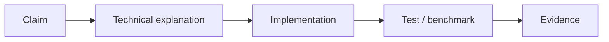

# Evidence

## What is evidence in WAM?

Evidence is verifiable information that supports a claim or requirement. WAM collects:
- **Test results**: Pass/fail status
- **Build artifacts**: Compiled binaries, packages
- **Logs**: Execution traces
- **Metrics**: Performance, token usage
- **File states**: Created/modified/deleted files

## Evidence chain

## Related documentation

- [Requirements](requirements.md)
- [Verification](verification.md)
