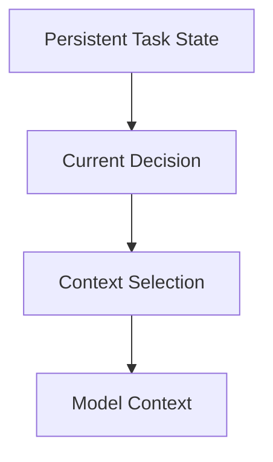

# State vs Context

## Principle

WAM separates persistent task state from transient model context.

This is one of the fundamental architectural properties of WAM.

## Persistent task state

Persistent state represents what WAM knows about a task. Depending on the
implementation, this may include:

- task identity;
- lifecycle state;
- requirements;
- assumptions;
- decisions;
- relevant artifacts;
- verified progress;
- evidence;
- selected capabilities;
- verification state.

Persistent state can survive multiple model interactions. In WAM it lives under
the runtime directory `.wam/` (task state in `.wam/tasks/<taskId>/`, context
capsules in `.wam/capsules/`, session identity in `.wam/session.json`) and is
written durably by the state store.

## Model context

Model context is the information assembled for the current model interaction. It
is derived from:

```text
task state
+
current request
+
relevant context
+
relevant skills
+
current evidence
```

The model does not need the complete persistent state on every interaction.

## The distinction



The important direction is:

```text
state → context
```

rather than:

```text
conversation history → larger and larger context
```

## Why this architecture matters

Separating state from context allows WAM to preserve task continuity while
controlling the amount of information sent to the model. This is the
architectural basis for:

- task isolation;
- context reconstruction;
- context reduction;
- skill enrichment;
- state recovery.

## Implementation verification

The state and context implementations identify:

1. where persistent task state is stored — `.wam/` via
   [`src/state/state-store.js`](../architecture/state-persistence.md);
2. how task identity is represented — task ids namespace task state in
   `src/state/task-store.js`;
3. how context is reconstructed — `src/context/context.js` and
   `src/context/assembly.js` (see
   [Context Selection](../architecture/context-selection.md));
4. which state fields can enter model context — selected capsules and assembled
   context packs;
5. how state survives between turns — durable writes and replay
   (see [State Persistence](../architecture/state-persistence.md)).

A field is described as persistent only when the implementation demonstrates its
persistence semantics.
