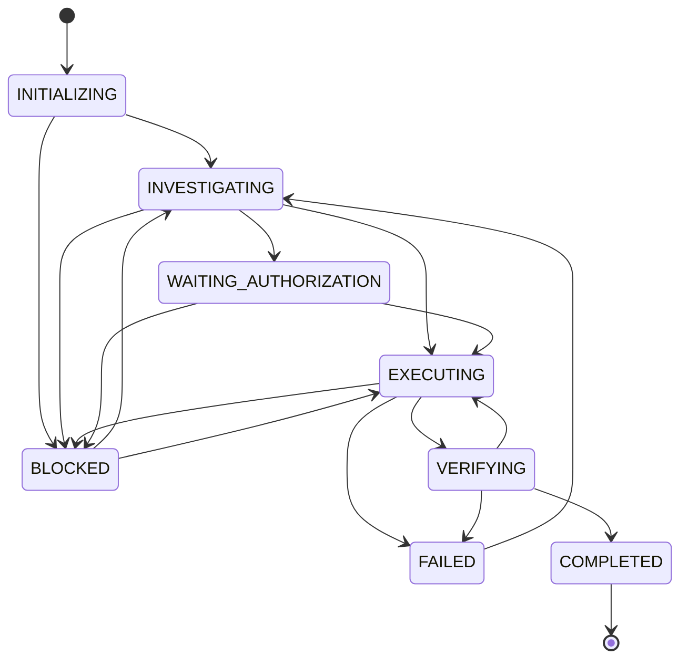

# Task and Context Lifecycle

A WAM task has a lifecycle. Model context is reconstructed during that lifecycle.

The authoritative state machine is implemented in
`src/execution/execution-state.js` and documented in
[Task Lifecycle](../architecture/task-lifecycle.md). The diagram below reflects
that implementation.



Legacy phase names are migrated into these states by `migrateLegacyPhase`
(`src/execution/execution-state.js`), e.g. `PROPOSED → INVESTIGATING`,
`IMPLEMENTING → EXECUTING`, `DONE → COMPLETED`.

## Context lifecycle

A task may move through multiple decisions:

```text
Task
 ↓
Current state
 ↓
Context selection
 ↓
Model interaction
 ↓
Observation
 ↓
Evidence
 ↓
Updated state
 ↓
Next context
```

Context therefore changes as the task changes. The task identity and verified
state provide continuity.

## Example

A task may initially require:

```text
repository structure
relevant source files
requirements
```

During verification it may instead require:

```text
changed files
test files
build configuration
verification evidence
```

The task remains the same. The model context changes because the task state
changed.

## See also

- [State vs Context](state-vs-context.md)
- [Task Lifecycle](../architecture/task-lifecycle.md)
- [Evidence-Driven State](evidence-driven-state.md)
